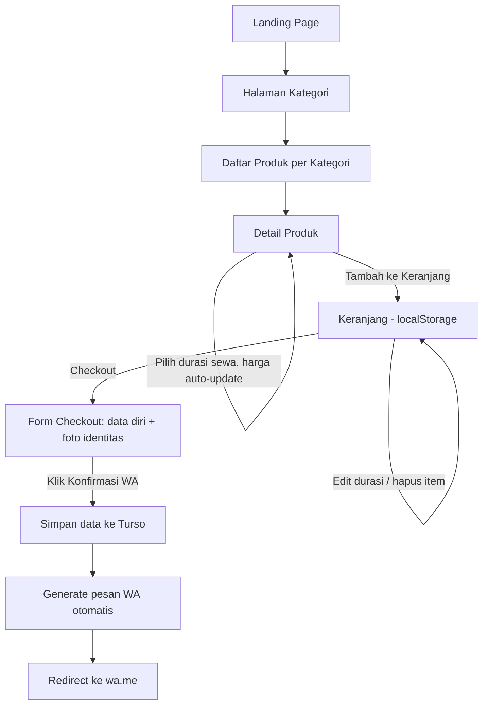
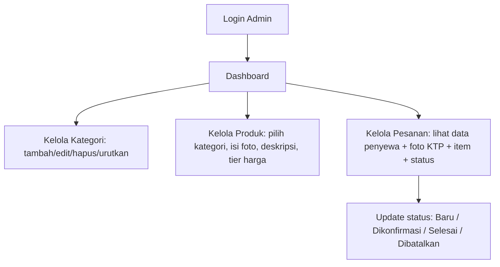

# PRD — [NAMA BRAND] Rental Alat Outdoor

## 1. Ringkasan Produk
Website untuk menyewakan alat outdoor (tenda, carrier, alat masak, dll). Customer bisa browsing dan memasukkan barang ke keranjang tanpa login, lalu checkout dengan mengirim data diri + foto identitas, dan transaksi difinalisasi lewat WhatsApp. Admin mengelola kategori, produk, harga sewa per durasi, dan data pesanan masuk.

## 2. Tujuan
- Customer bisa memilih alat + durasi sewa dan langsung tahu total harga tanpa perlu tanya-tanya manual.
- Mengurangi effort admin: data penyewa, barang, dan foto identitas otomatis tercatat begitu customer konfirmasi.
- Kategori & produk fleksibel dikelola admin tanpa perlu ubah kode.

## 3. Target Pengguna
- **Customer**: tidak perlu akun, akses dari HP maupun desktop, mayoritas mobile karena alur berakhir di WhatsApp.
- **Admin**: 1 pengguna (pemilik/operator rental), akses dari desktop.

## 4. Tech Stack
- Next.js (App Router) + TypeScript
- Tailwind CSS
- Zustand (state cart, persist ke localStorage)
- TanStack Query (fetching data produk/kategori/pesanan dari API)
- Turso (SQLite edge) sebagai database
- Vercel untuk hosting
- Rekomendasi tambahan: **Vercel Blob** (atau storage sejenis) untuk upload foto produk & foto KTP/SIM/KTM — Turso hanya menyimpan URL-nya, bukan file binary.

## 5. Peta Halaman (Sitemap)

**Publik (Customer)**
1. `/` — Landing Page
2. `/kategori` — Semua Kategori
3. `/kategori/[slug]` — Daftar Produk per Kategori
4. `/produk/[slug]` — Detail Produk
5. `/keranjang` — Cart
6. `/checkout` — Checkout
7. `/checkout/sukses` — Konfirmasi terkirim (sebelum redirect WA)

**Admin**
8. `/admin/login`
9. `/admin` — Dashboard
10. `/admin/kategori` — Kelola Kategori
11. `/admin/produk` — Kelola Produk (list + form tambah/edit)
12. `/admin/pesanan` — Kelola Pesanan/Penyewaan (list + detail)

## 6. User Flow — Customer



Catatan penting:
- Durasi sewa **tidak berupa input bebas**, melainkan pilihan chip/dropdown dari tier yang sudah didefinisikan admin per produk (mis. 2/3/4/5 hari). Ini menghindari kasus customer memilih durasi yang harganya belum didefinisikan.
- Total harga di keranjang = jumlah harga tier yang dipilih tiap item (bukan hasil kali harga per hari × jumlah hari, karena tier tidak linear).
- Data ke database **baru tersimpan saat tombol "Konfirmasi via WhatsApp" diklik**, bukan saat item masuk keranjang.

## 7. User Flow — Admin



## 8. Fitur Detail

### 8.1 Landing Page
- Hero dengan CTA ke halaman kategori
- Highlight kategori populer (grid ikon/foto)
- Cara sewa (3–4 langkah singkat: pilih alat → pilih durasi → checkout → ambil di lokasi)
- Testimoni (opsional, jika ada data)

### 8.2 Kategori & Produk
- Default 8 kategori: Tenda, Carrier, Alat Masak, Elektronik, Penerangan, Survival, Perlengkapan Pribadi, Perlengkapan Tambahan — **fully editable oleh admin** (nama, ikon/foto, urutan tampil, aktif/nonaktif).
- Halaman produk per kategori menampilkan grid card: foto, nama, harga mulai dari (tier termurah), badge stok jika perlu.

### 8.3 Detail Produk & Pricing
- Galeri foto produk
- Deskripsi produk
- Tabel/chip pilihan durasi sewa beserta harga masing-masing (contoh nyata dari referensi: 2 hari Rp38.000, 3 hari Rp52.000, 4 hari Rp62.000, 5 hari Rp72.000)
- Harga total ter-update otomatis begitu durasi dipilih
- Tombol "Tambah ke Keranjang"

### 8.4 Keranjang (Cart)
- Disimpan di Zustand dengan persist middleware → localStorage
- List item: foto, nama, durasi terpilih (bisa diubah di sini), harga, tombol hapus
- Total harga keseluruhan otomatis terhitung ulang tiap perubahan
- Tombol "Checkout"

### 8.5 Checkout & WhatsApp
- Form: Nama lengkap, No. HP/WA, Alamat (opsional), Upload foto KTP/SIM/KTM
- Ringkasan pesanan (read-only, diambil dari state keranjang): daftar item + durasi + subtotal + total
- Tombol "Konfirmasi via WhatsApp" — saat diklik:
  1. Validasi form (nama, no HP, foto identitas wajib)
  2. Upload foto identitas ke storage → dapat URL
  3. Simpan order ke Turso (data diri, items, total harga, URL foto identitas, status = "Baru")
  4. Generate teks pesan WA otomatis (nama, list barang+durasi, total harga)
  5. Redirect ke `https://wa.me/[NOMOR_ADMIN]?text=[pesan_terenkode]`
- Nomor WA tujuan diambil dari config/env, bukan hardcode di kode UI.

### 8.6 Admin — Dashboard
- Ringkasan: jumlah pesanan baru, produk terlaris (opsional untuk v2), total kategori & produk aktif

### 8.7 Admin — Kelola Kategori
- Tabel kategori + tombol tambah/edit/hapus
- Reorder (drag atau input urutan)
- Toggle aktif/nonaktif (kategori nonaktif tidak muncul di publik)

### 8.8 Admin — Kelola Produk
- List produk per kategori dengan filter kategori
- Form tambah/edit: nama, kategori, deskripsi, upload foto (multi), **tabel tier harga dinamis** (admin bisa tambah/hapus baris durasi & harga bebas, tidak harus berurutan atau linear)
- Toggle aktif/nonaktif produk

### 8.9 Admin — Kelola Pesanan
- List pesanan: nama penyewa, tanggal masuk, total harga, status
- Detail pesanan: data diri lengkap, foto identitas (preview), list item + durasi + harga per item
- Update status pesanan

## 9. Data Model (ringkas)

```
Category
- id, name, slug, image_url, sort_order, is_active

Product
- id, category_id, name, slug, description, images (array/JSON), is_active

PricingTier
- id, product_id, days (int), price (int)
  -- tidak wajib linear; admin bebas menambah kombinasi durasi & harga apa pun

Order
- id, customer_name, phone, address (nullable), id_photo_url,
  total_price, status (baru|dikonfirmasi|selesai|dibatalkan), created_at

OrderItem
- id, order_id, product_id, product_name (snapshot), days, price (snapshot)
```

Catatan: `product_name` dan `price` di-snapshot ke OrderItem saat order dibuat, supaya histori pesanan tidak berubah kalau admin edit produk/harga di kemudian hari.

## 10. Business Rules
- Harga sewa TIDAK dihitung dari harga per hari dikali jumlah hari — setiap durasi punya harga tetap sendiri (tier), sesuai contoh produk yang diberikan.
- Customer hanya bisa memilih durasi yang sudah didefinisikan admin untuk produk tersebut.
- Order baru tersimpan di database pada saat klik "Konfirmasi via WhatsApp", bukan lebih awal.
- Kategori & produk nonaktif tidak tampil di halaman publik tapi datanya tetap ada (soft delete via `is_active`), supaya histori pesanan lama tidak rusak.

## 11. Non-Functional Requirements
- **Desain**: hindari pola "AI slop" — tanpa gradient ungu generik, tanpa glassmorphism berlebihan, tanpa emoji di UI, tanpa eyebrow text kecil di atas heading, tanpa badge/dot animasi pulsing. Gunakan tipografi kuat sebagai hierarchy utama, foto produk sebagai fokus, palet warna earthy (hijau tua, terracotta, krem).
- Mobile-first, karena alur checkout berakhir di WhatsApp (mayoritas dari HP).
- Kontras warna minimal WCAG AA.
- Konten asli (bukan lorem ipsum) di semua contoh produk.

## 12. Asumsi & Batasan
- Tidak ada sistem pembayaran online di v1 — transaksi & pembayaran dilanjutkan manual via WhatsApp.
- Tidak ada login/akun customer.
- Admin hanya 1 role (tidak ada multi-level admin) di v1.
- Ketersediaan stok/kalender booking tidak termasuk v1 (bisa jadi v2).

## 13. Out of Scope (v1)
- Payment gateway
- Notifikasi email/SMS
- Multi-admin dengan role berbeda
- Kalender ketersediaan barang real-time
